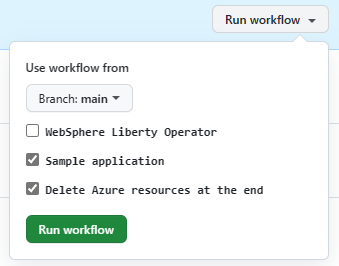

# How to update IBM WebSphere Liberty and Open Liberty on Azure Red Hat OpenShift solution template offer in partner center

Please follow sections below in order to update the solution template offer in partner center.

## When should I update the offer in partner center?

If you make any changes for files located in the following path:

* `src/main/arm`
* `src/main/bicep`
* `src/main/scripts`

## Update the version of the solution template

If you haven't bumped the version, pls do so before publishing the solution template to partner center. 

1. Increase the [version number](https://github.com/WASdev/azure.liberty.aro/blob/main/pom.xml#L23) which is specified in the `pom.xml`.
1. Get the PR merged.

## Run integration test workflow to verify the changes

There is an `integration-test` workflow which will deploy the Azure resources defined in the solution template, deploy a sample app to the ARO and verify the deployment.
It's strongly recommended to run the `integration-test` workflow to verify the code changes before publishing the offer.

1. Go to [Actions](https://github.com/WASdev/azure.liberty.aro/actions) > Click `integration-test` > Click to expand `Run workflow`.
1. You will see a popup listing all inputs you can customize, select appropriately. For example, select **WebSphere Liberty Operator** if your changes relate to WebSphere Liberty Operator.

   

1. Click `Run workflow` > Refresh the page.
1. Wait until the run of workflow `integration-test` successfully completes. If any failures are observed, you must triage and fix before proceeding.

## Upload the artificat to partner center

Once the run of workflow `integration-test` succeeds, you can choose manually or automatically upload the artifact to partner center and save it as a draft.

### Manually upload the artifact and save as draft

You can leverage the output of workflow `integration-test` run to manaully upload the generated artifact and save it as a draft in partner center.

1. Click to open details of the run of workflow `integration-test` > Scroll to the bottom of the page.
1. Click `azure.liberty.aro-<version>-arm-assembly` to download the zip file `azure.liberty.aro-<version>-arm-assembly.zip`.
1. Sign into [Microsoft Partner Center](https://partner.microsoft.com/dashboard/commercial-marketplace/overview).
   * Click to open the offer for the solution (likely `20210823-liberty-aro`) > Click `Plan overview`.
   * Click to open the plan > Click `Technical configuration`.
   * Specify the increased version number for `Version` (note, the version is in the zip file name).
   * Click `Remove` to remove the previous package file.
   * Click `browse your file(s)` to upload the downloaded zip package generated by the CI/CD pipeline before.
   * Scroll to the bottom of the page.
   * Click `Save draft`.

### Automatically upload the artifact and save as draft

You can also run another workflow `Package ARM` to automatically upload the generated artifact and save it as a draft in partner center.

1. Go to [Actions](https://github.com/WASdev/azure.liberty.aro/actions) > Click `Package ARM` > Click to expand `Run workflow` > Click `Run workflow` > Refresh the page.
1. Wait until the CI/CD workflow for `Package ARM` successfully completes. The workflow will update the offer with the generated artifact and save it as draft in partner center. 
1. Sign into [Microsoft Partner Center](https://partner.microsoft.com/dashboard/commercial-marketplace/overview), find the offer (`20210823-liberty-aro`) and its plan, you should see a new version of draft exists from page **Technical configuration**.

## Review and publish the offer

Once the new version of draft is saved, you can start review and publish process. Make sure you're in the page **Technical configuration** of the offer's plan.

1. Click `Review and publish`.
1. In the "Notes for certification" section enter the `integration-test` URL.
1. Click `Publish`.
1. Wait until solution offer is in `Publisher signoff` (aka "preview") stage and "Go Live" button appears(it could take few hours).
1. Before clicking "Go Live" use the preview link to test the solution. If any issues are observed, you must triage, fix and re-go through the previous steps before proceeding.
1. Click "Go Live".
1. Wait for remaining steps to complete (may take couple of days).
1. Make sure to delete your test deployments.
1. Once the solution is in "Publish" stage, new version is publicly available.
1. To verify the version number, launch the solution in Azure portal and hover over "Issue tracker" and it should display the version number. For example, https://aka.ms/azure-liberty-aro-issues?version=1.0.44.

## Create a release and a tag with the GA code

It's recommended to create a new release if significant changes are introduced.

1. Create a [release](https://github.com/WASdev/azure.liberty.aro/releases) for this GA code and tag with the `pom.xml` version number.
