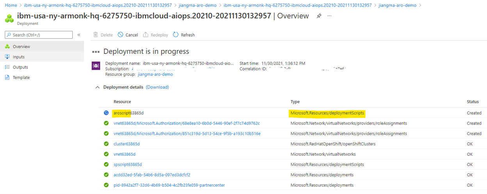
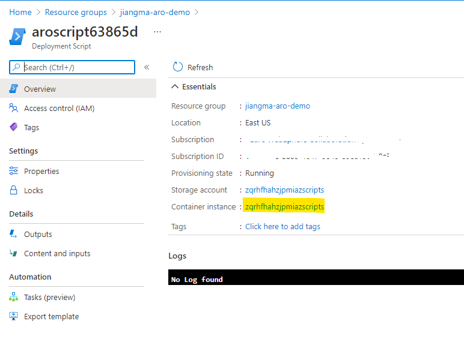
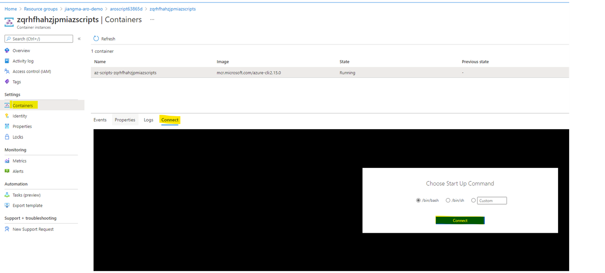
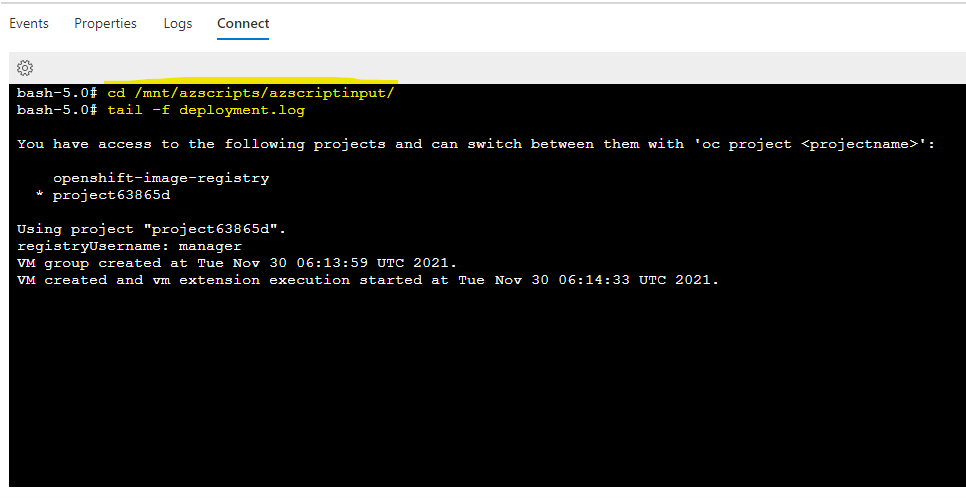
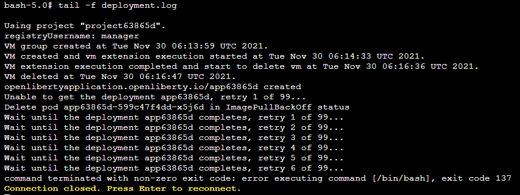

<!-- Copyright (c) Microsoft Corporation. -->
<!-- Copyright (c) IBM Corporation. -->

## Inspect the runtime log

The runtime log of the primary deployment script is stored in the Azure storage account which is mounted to the Azure container instance. Both Azure storage account and Azure container instance are created by the Azure deployment script at runtime. However, they will be removed immediately once the deployment script successfully completed. 

To monitor the deployment process and check the log data, you can inspect the runtime log by following the steps below:

1. Kick off the deployment after providing all necessary inputs in [Create IBM WebSphere Liberty and Open Liberty on Azure Red Hat OpenShift](https://portal.azure.com/#create/ibm-usa-ny-armonk-hq-6275750-ibmcloud-aiops.20210823-liberty-aroliberty-aro);
1. Watch the deployment page until the resource prefixed with **aroscript** is created:

   

1. Click **resource group name** > **resource prefixed with aroscript** > Click the name of **Container instance**:

   

1. Click **Containers** > **Connect** > Click **Connect** in the pop window

   

1. Wait until the container is running and connection is ready. The path of runtime log file is `/mnt/azscripts/azscriptinput/deployment.log`. You can monitor the deployment process using `tail` command as below:

   

1. Once the deployment script completed successfully, the connection will be automatically closed:

   

Besides, the Azure storage account and Azure container instance will be kept for one day if the deployment script finished with errors. So, user can inspect the runtime log after the deployment, starting from step #3.

## Download the log file

However, if you want to download the log file into your local computer before the storage account is removed, reference the following steps:

1. Find your resource group where the deployment is located.
1. Select Deployment Script prefixed with **aroscript**.
1. Search the web page with keyword **Storage account**, select the storage account you find.
1. Under **Data storage** in the left navigation panel, select **File shares**. You will see one file share listed. Select it.
1. Select **Browse** in the left navigation panel. You will see two directories. Select **azscriptinput**.
1. You will see a list of files. Select **deployment.log** which is the log file you're looking for.
1. In the pop up **File properties**, select **Download**. The log file will be downloaded to your local computer.
