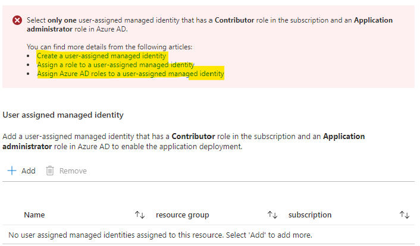
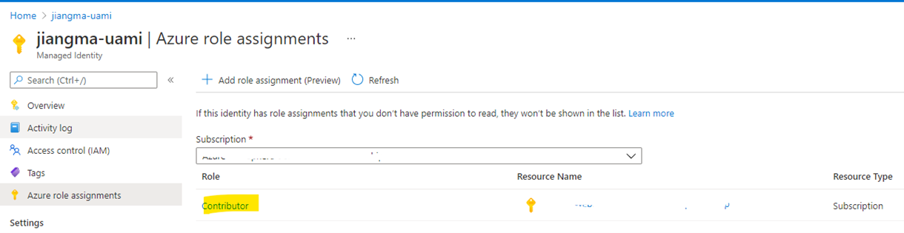

## Check the permissions of user-assigned managed identity

The offer depends on a user-assigned managed identity to facilitate the deployment:

1. Create service principal and get Object IDs;
1. Access the cluster, create VM, etc.

So, the following permissions must be granted to the selected user-assigned managed identity before kicking off the deployment:

1. **Contributor** role in the subscription
1. **Application administrator** role in Azure AD

The instructions on how to create the user-assigned managed identity and grant required permissions can be found in the UI of the offer:

You can follow steps below to verify if permissions are correctly granted to the user-assigned managed identity (reach out to your tenant administrator if you don’t have privilege to check):

1. Check **Contributor** role in the subscription is added:
   1. Open the selected user-assigned managed identity > Click **Azure role assignments**. Check **Contributor** role is listed in your subscription.

      

1. Check Application administrator role in Azure AD is added:
   1. Open home page of Azure portal > Type **Azure Active Directory** in the search box and click to open > Click Roles and administrators > Click Application administrator > Check the selected user-assigned managed identity is listed.

## Inspect the runtime log

The runtime log of the primary deployment script is stored in the Azure storage account which is mounted to the Azure container instance. Both Azure storage account and Azure container instance are created by the Azure deployment script at runtime. However, they will be removed immediately once the deployment script successfully completed. 

To monitor the deployment process and check the log data, you can inspect the runtime log by following the steps below:

1. Kick off the deployment after providing all necessary inputs in [Create IBM WebSphere Liberty and Open Liberty on Azure Red Hat OpenShift](https://portal.azure.com/#create/ibm-usa-ny-armonk-hq-6275750-ibmcloud-aiops.20210823-liberty-aroliberty-aro);
1. Watch the deployment page until the resource prefixed with **aroscript** is created:

   

1. Click **resource group name** > **resource prefixed with aroscript** > Click the name of **Container instance**:

   

1. Click **Containers** > **Connect** > Click **Connect** in the pop window

   

1. Wait until the container is running and connection is ready. The path of runtime log file is `/mnt/azscripts/azscriptinput/deployment.log`. You can monitor the deployment process using `tail` command as below:

   

1. Once the deployment script completed successfully, the connection will be automatically closed:

   

Besides, the Azure storage account and Azure container instance will be kept for one day if the deployment script finished with errors. So, user can inspect the runtime log after the deployment, starting from step #3.